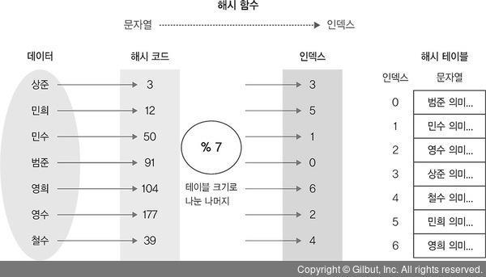

저장소와 검색
===========

 

##### 1. 관계형 데이터베이스와 NoSQL 데이터베이스에 사용되는 엔진에 대해 알아본다.
##### 2. 로그 구조(log-structured) 계열 저장소 엔진과 페이지 지향(page-oriented) 계열 저장소 엔진을 검토한다.
> 여기서 언급된 로그란 연속된 추가 전용 레코드이다.

 
 

해시 테이블 색인
--------------

 

##### 먼저 해시 함수, 해시 테이블에 대해 알아보자.
* 해시 함수란 임의의 길이를 갖는 임의의 데이터에 대해 고정된 길이의 데이터로 매핑하는 함수를 말한다.
* 해시 함수 입력값을 키라 하고 해싱 후의 값을 해시값이라 한다.
* 해시 테이블(해시 맵)이란 검색어에 해당하는 키값을 해싱하여 해시값(인덱스)을 얻은 후 배열을 사용하여 데이터와 매핑시킨 테이블을 말한다.

 

 
 

##### 해시 테이블을 색인표로 활용하여 간단한 데이터베이스를 만들 수 있다.
* 파일에 데이터를 계속 추가만 한다면 디스크 공간이 부족해지므로 특정 크기의 **_세그먼트_**(segment)로 나누어 저장하는 방식을 도입한다.
* 또한, 세그먼트 파일들을 대상으로 중복을 제거하고 최신 데이터만 추출하여 신규 세그먼트 파일을 생성하는 **_컴팩션_**(compaction) 기능도 도입한다.
> 쓰기 쓰레드는 중복을 신경쓰지 않고 오로지 입력되는 값을 현재 세그먼트 파일에 추가하는 작업만한다.

 
 

##### 단점도 있다.
* 해시 테이블은 메모리에 저장하기 때문에 키가 너무 많아지면 문제가 된다.
* 해시 테이블은 범위 질의에 효율적이지 않다. 범위내 모든 개별 키를 조회해야 한다.

 

Sorted String Table(SS 테이블)
--------------

 

* 로그 구조화 저장소 세그먼트는 키-값 쌍의 연속이다.
* 키-값 쌍은 쓰여진 순서대로 저장되며 나중값이 이전값보다 우선한다.
* 세그먼트 파일 형식에 키-값 쌍을 키로 정렬하는 방식을 도입해보자.
* 이렇게 키로 정렬된 세그먼트 형식을 **_정렬된 문자열 테이블_**(sorted string table)이라 한다.

 

##### 장점이 있다.
* 각 세그먼트 파일은 정렬되어 있기 때문에 컴팩션 수행시에 **_병합정렬_**(merge sort) 과 유사한 알고리즘으로 처리가 가능하다.
* 데이터가 키값 기준으로 정렬되어 있기 때문에 인메모리 희소 색인(sparse index) 내용으로도 찾고자하는 키값의 색인범위를 알 수 있다.
> handiwork 키의 인덱스가 인메모리 색인에 없더라도 handbag 과 handsome 인덱스 사이에 있다는 것을 알 수 있다.

 

##### SS 테이블 저장소 엔진
* 메모리 상에 정렬된 데이터 구조를 유지하다가 임계점을 넘으면 메모리 내용을 파일에 기록하고 새로운 메모리 데이터 구조를 생성하여 유지한다.
    1. 입력이 들어오면 인메모리 균형 트리(예, 레드 블랙 트리)에 추가한다.
        > 이 인메모리 트리를 멤테이블(memtable)이라 한다.
    2. 멤테이블이 임계값보다 커지면 SS 테이블 파일로 디스크에 기록한다. 새로운 SS 테이블 파일은 데이터베이스의 가장 최신 세그먼트가 된다.
        > SS 테이블을 디스크에 기록하는 동안 쓰기는 새로운 멤테이블 인스턴스에 기록된다.
    3. 읽기 요청이 들어오면 먼저 멤테이블에서 조회하고 다음으로 가장 최신 세그먼트부터 순차적으로 탐색한다.
    4. 백그라운드에서 주기적으로 컴팩션과정을 수행한다.
* 이 구조에서 한 가지 문제점은 데이터베이스가 고장나면 멤테이블 정보가 날라가는 것이다.
* 이를 해결하기 위해서 멤테이블에 쓰여지는 데이터는 별도로 분리된 로그로써 디스크 상에 유지해야 한다.
    > 현재 멤테이블 데이터를 디스크에서 관리하는 분리된 로그는 장애시 복구용이기 때문에 순서가 정렬되지 않아도 된다.
* 멤테이블을 SS 테이블에 기록하고 나면 분리된 로그는 삭제해도 된다.

 

##### LSM 트리
* 위의 SS 테이블 저장소 엔진 구조는 **_로그 구조화 병합 트리_**(Log-Structured Merge-Tree) 라고도 한다.
    > 정렬된 파일 병합과 컴팩션 원리를 기반으로 하는 저장소 엔진을 LSM 저장소 엔진이라 부른다.
* 아래는 LSM 트리가 적용된 실제 구현 사례이다.
    * 구글의 LevelDB
        * 빠르고 가벼운 Key-Value 기반의 저장소 Library
        * C++ 로 개발됨
        * 데이터는 Key 로 정렬되어 저장된다.
        * 데이터는 구글의 Snappy 압축방식으로 압축되어 저장됨
    * 페이스북의 RocksDB
        * LevelDB 발표 2년 후 LevelDB에 기반해 개발한 후 공개
        * 서버 PCI 슬롯에 장착되는 플래시카드의 성능을 극대화한 키-값 스토리지 라이브러리
    * 루씬의 용어 사전(term dictionary)
        * 키를 검색단어로, 값은 검색단어를 포함한 모든 문서의 ID 목록으로 하는 키-값 구조로 구현
    * Apache Cassandra
        * 대규모 확장 가능한 분산 NoSQL 데이터베이스로 페이스북에서 개발하여 2008년 오픈소스로 공개
            * 구글 BigTable 의 컬럼 기반 데이터 모델 사용
            * 페이스북의 Dynamo 분산 모델 사용
        * Java 로 개발됨
        * NoSQL 컬럼형 데이터베이스
    * Apache HBase
        * Hadoop 의 HDFS 위에 만들어진 분산 컬럼 기반의 데이터베이스
            * HDFS 는 분산 파일 시스템으로 매우 큰 파일을 저장하는데 적합함
        * ACID 를 지원하며 High Scale, Real-Time Application 을 위한 최적의 선택

 

##### 블룸 필터(Bloom filter)
* LSM 트리에서 없는 키를 찾는 경우 멤테이블과 모든 세그먼트 파일을 탐색해야하는 문제가 있다.
* 이를 해결하기 위해 블룸 필터를 사용한다.
* 블룸 필터는 어떤 값이 집합에 속해있는지를 검사하는 필터 및 이를 구성하는 자료형을 말한다.
* Key 를 해싱하여 bit 해시 값을 얻고 이러한 bit 값들을 bitmap 에 저장하여 Key 의 유/무를 표시한다.
* bit 단위로 체크하기 때문에 메모리 사용량을 많이 줄일 수 있다.
* 해시 충돌이 나면 Key 가 없는데 있다고 할 수도 있고, 있는데 없다고 할 수도 있다.

 
 

* 적을 내용
* [x] 해시색인
* [x] 세그먼트와 컴팩션
* [x] SS 테이블
* [x] LSM 트리
* [ ] B 트리
* [ ] 기타 색인 구조